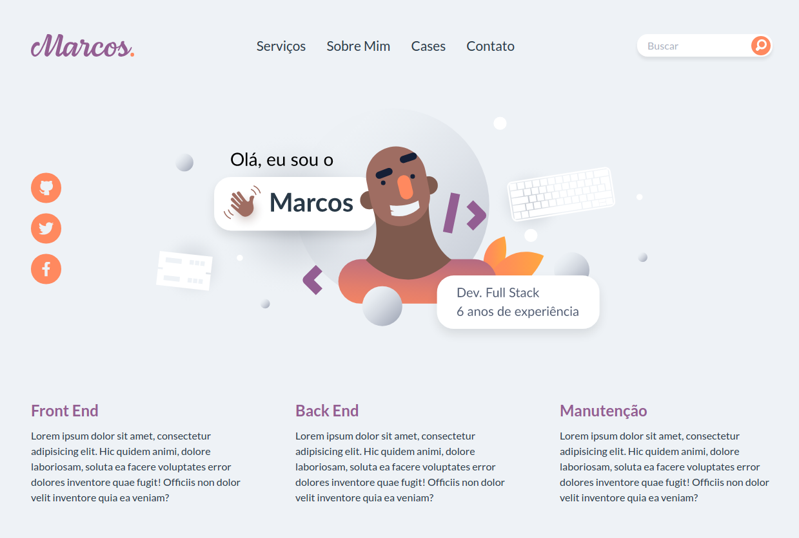
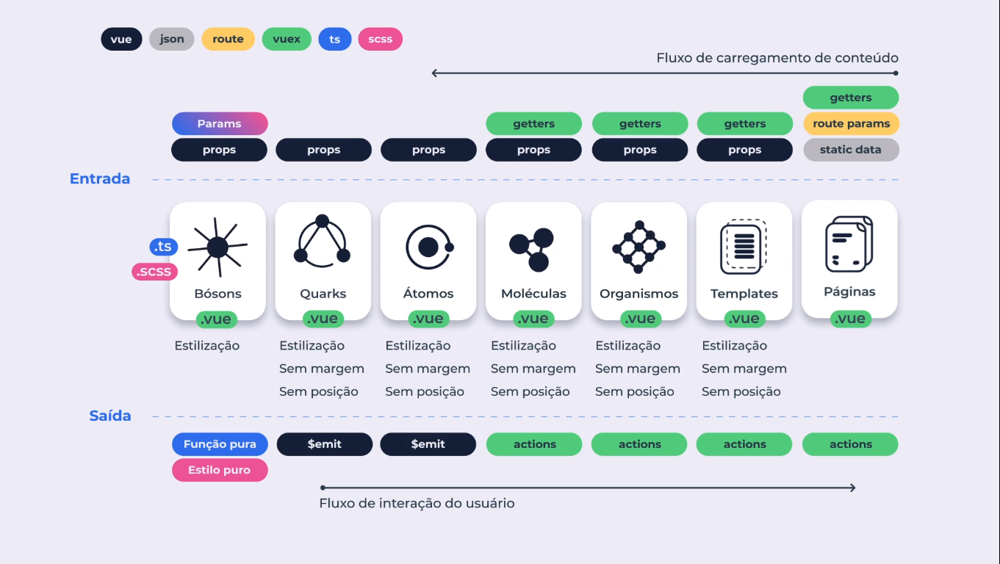

# Atomic Design

Projeto baseado no curso da plataforma [Cataline](https://www.cataline.io/) com o objetivo entender a estrutura básica do padrão Atomic Design, utilizando Vue.js

## Projeto

Modelo do projeto desenvolvido, respeitando a criação de componentes, átomos, moléculas, organimos e templates.



## Atomic Design Schema

Esquema apresentado no curso, com novas visões do instrutor: adicionando Quarks e Bósons.



## Project setup

```
npm install
```

### Compiles and hot-reloads for development

```
npm run serve
```

### Compiles and minifies for production

```
npm run build
```
